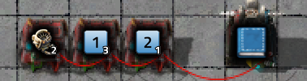
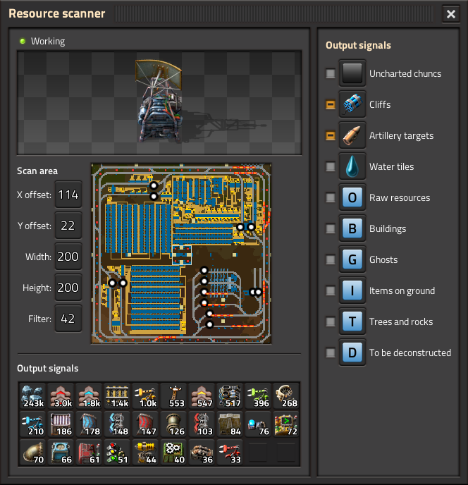

Adds a Blueprint Deployer chest which can be connected to the circuit network to build a self-expanding factory.

Example commands:

Deploy blueprint.
Construction robot signal is the "use blueprint" command. Can be any value ≠ 0.

*Important note*: starting from version Factorio 2.0, the signal for this command has been replaced with "Virtual zero". The previous signal can be returned by map setting "Deploy signal for the deployer".

---

Deploy blueprint from book.
Construction robot signal selects which slot in book to use.
If it is greater than the size of the book, the active blueprint is used instead.
A signal less than zero means cancel deconstruction/upgrade if there is a deconstruction/upgrade plan in the selected slot (for more information about these plans, see below). Of course, the minus sign is ignored when choosing a slot number in the book.

---

Selection of nested books.
To select blueprint in book (which may also be in the book), additional signals 1 to 5 indicate which slot to use at the corresponding nesting level. (Construction robot signal is considered as the zero level)

---

Deconstruct or upgrade area.
"W" = width, "H" = height.
Supports deconstruction filters.
The deployer chest will never deconstruct itself with this command.

---

Cancel deconstruction or upgrades in area.
It can also be used inside books, as described above.

---

Alternative deconstruction commands that do not require a deconstruction planner in the deployer chest.

-1 = Deconstruct area.\
-2 = Deconstruct the deployer chest.\
-3 = Cancel deconstruction in area.\
-4 = Deconstruct area with provided item signals as whitelist.\
-5 = Deconstruct area with provided item signals as blacklist.\
-6 = Cancel area deconstruct with provided item signals as whitelist.\
-7 = Cancel area deconstruct with provided item signals as blacklist.

For the blacklist/whitelist, only positive signals of items are used.

Special filter signals:

Signal "T">0 - trees\
Signal "R">0 - rocks\
Signal "C">0 - cliffs

---

Copy blueprint or blueprint book. The original blueprint must be in a chest (or inserter with read hand contents) on the same circuit network as the deployer chest.

---

Delete blueprint or blueprint book.

---

*Additional parameters*

"X" and "Y" signals shift the position of the construction/deconstruction/upgrade order.

Deconstruction and upgrades use "X", "Y" as the top left corner of the area. This can be changed to the center of the area in mod settings. (This option affects the scanner (see below) in a similar way)

"R" signal rotates the blueprint. "R" = 1 = 90° clockwise, "R" = 2 = 180°, "R" = 3 = 90° counterclockwise.

"F">0 signal use "Super force building"™ for blueprint.

To change the center of the blueprint, enable grid size (1x1 is recommended), and set an absolute reference point.

"L" signal is used to display debug messages (it is necessary to enable the trigger condition in the mod settings).
Each activation will display in the chat the location of the triggered deployer, the name of the blueprint and the place where the blueprint is applied (if the offset is not zero)
*Warning*: The chat may omit some of the messages if they are displayed very quickly.

---

The mod also adds a Resource Scanner that can help detect places to build.

---

Or check what is already built.

---

The scanner can display the number of different categories of objects. Some categories are indistinguishable in display, such as constructed buildings and their ghosts. Filters can separate categories from each other. The filter number is a bit mask of the signals to be displayed. (To display multiple categories, the corresponding numbers must be added together)

1 - Empty. Can be used to trigger a rescan.\
2 - Filter: raw resources.\
4 - Filter: trees, stones, fish ("Trees/rocks only" option of the deconstruction planner).\
8 - Filter: buildings.\
16 - Filter: ghosts.\
32 - Filter: items on ground.\
64 - Counter: uncharted chuncs.\
128 - Counter: cliffs.\
256 - Counter: artillery targets.\
512 - Counter: water tiles.\
1024 - Counter: raw resources.\
2048 - Counter: buildings.\
4096 - Counter: ghosts.\
8192 - Counter: items on ground.\
16384 - Counter: trees, stones, fish.\
32768 - Counter: buildings marked for deconstruction.

Actually, when you select a filter, an interface opens with a bunch of checkboxes that will calculate the number for you. It also works in the opposite direction.
